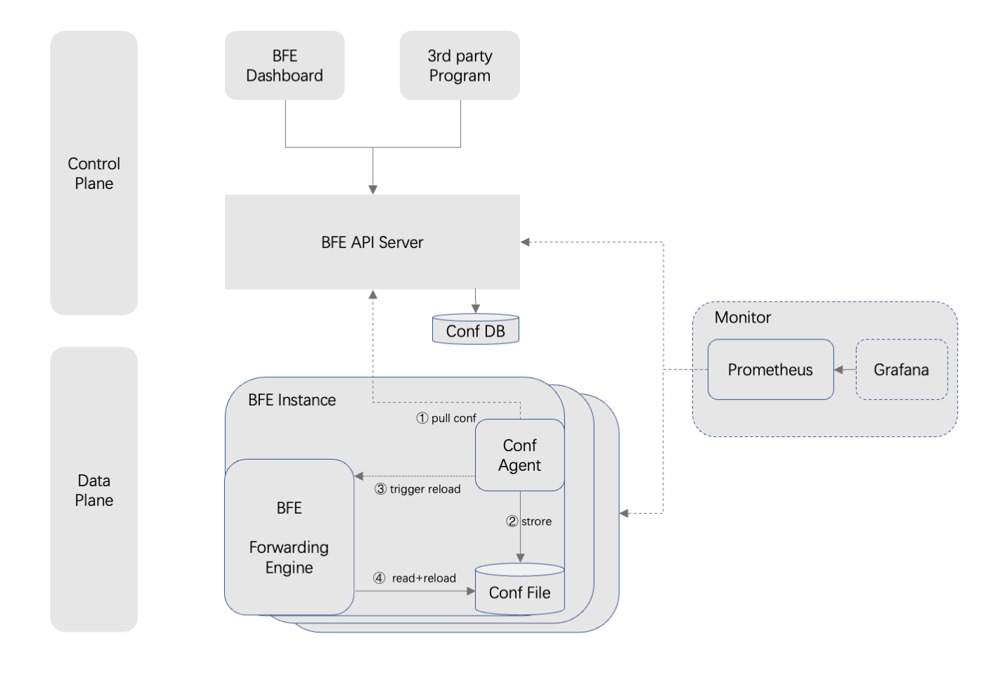

本文讲解如何部署 BFE 控制面组件。

# BFE控制面组件
BFE控制面包含如下组件：
- API Server: 对外提供Open API接口，完成BFE配置的变更、存储和下发
- Dashboard: 管理控制台，用于BFE集群的可视化管理
    - 仓库地址在 [bfenetwork/dashboard](https://github.com/bfenetworks/dashboard)
- Conf Agent: 配置加载组件，完成最新配置的获取和 BFE 热加载的触发
    - 仓库地址在 [bfenetwork/conf-agent](https://github.com/bfenetworks/conf-agent)

# 部署架构

图1：部署架构

如图1所示：
- 配置变更：
    - 系统管理人员可以通过 BFE Dashboard 相关配置进行可视化管理
    - 也可以通过调用 BFE API Server 提供的 Open API进行管理
- 配置下发：
    - Conf Agent和BFE同机部署
    - Conf Agent和API Server通信，在发现有新的配置后，将新的配置读取到BFE所在的服务器，并触发BFE执行配置热加载
    - BFE被触发后，读取最新的配置并生效

# 部署步骤

部署步骤依次为：
1. API Server 部署
1. Dashboard 部署
1. Conf Agent 部署

## API Server 部署
1. 安装MySQL数据库：数据库版本5.6以上即可，具体安装过程本文不详细描述
1. 初始化数据库： 执行 `mysql -u{user} -p{password} < db_ddl.sql`
1. 获取API Server可执行程序
    - 方式一：通过源码编译：clone本仓库后进入项目根目录，执行 `make`，output文件夹包括了可执行文件和初始配置文件
    - 方式二：直接进入 [releases](https://github.com/bfenetworks/api-server/releases) 页面下载相应的编译产出
1. 修改初始配置文件，详见[配置文件说明](./config_param.md)
- 特别注意：绝大多数配置可以使用默认配置，最小修改集合为 **数据库用户名和密码**
1. 启动 API Server。执行`./api-server -c ./conf -sc api_server.toml -l ./log `。如果不需要指定启动参数，直接执行 `./api-server` 即可

## Dashboard 部署
1. 获取 Dashboard 产出
    - 方式一：通过源码编译： clone [bfenetwork/dashboard](https://github.com/bfenetworks/dashboard) 仓库后进入项目根目录，执行 `sh build.sh`， output 文件夹就是静态配置文件
    - 方式二：直接进入 [dashboard/releases](https://github.com/bfenetworks/dashboard/releases) 页面下载相应的编译产出
1. 部署：将output文件夹的内容拷贝到 API Server 的 static 文件夹（默认在api-server可执行文件同级目录）中即可
1. 浏览器打开 http://host:{ServerPort} (ServerPort 为 API Server 部署时配置的端口号) 即可看到登录页面，测试账号和密码都是 `admin`。登陆后，请立刻修改您的admin的密码

可查看 [Dashboard 使用文档](https://github.com/bfenetworks/dashboard/docs/zh-cn/user-guide/SUMMARY.md) 了解BFE管理控制台的基本概念和使用流程。

## Conf Agent 部署
Conf Agent和 BFE 转发引擎同机部署。

若未部署BFE转发引擎，可参考[BFE安装部署](https://www.bfe-networks.net/en_us/installation/install/)完成部署。

**若BFE已经上线运行，有历史配置数据，需要完善业务配置才能启动Conf Agent，本文不展开描述。**

1. 获取Conf Agent可执行程序
    - 方式一：通过源码编译：clone [bfenetwork/conf-agent](https://github.com/bfenetworks/conf-agent) 仓库后进入项目根目录，执行 `make`， output文件夹包括了可执行文件和初始配置文件
    - 方式二：直接进入 [releases](https://github.com/bfenetworks/conf-agent/releases) 页面下载相应的编译产出
1. 修改配置，详见 [配置文件说明](https://github.com/bfenetworks/conf-agent/blob/develop/docs/zh_cn/config.md)，使其能访问API Server导出最新的配置
1. 启动 Conf Agent。执行 `./conf-agent`